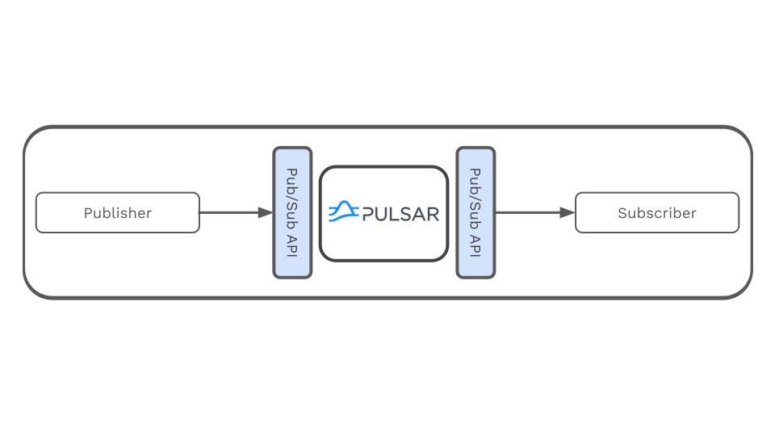
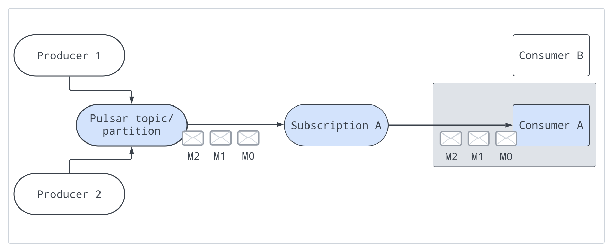
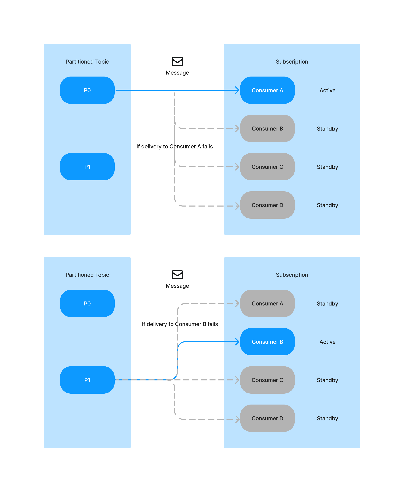
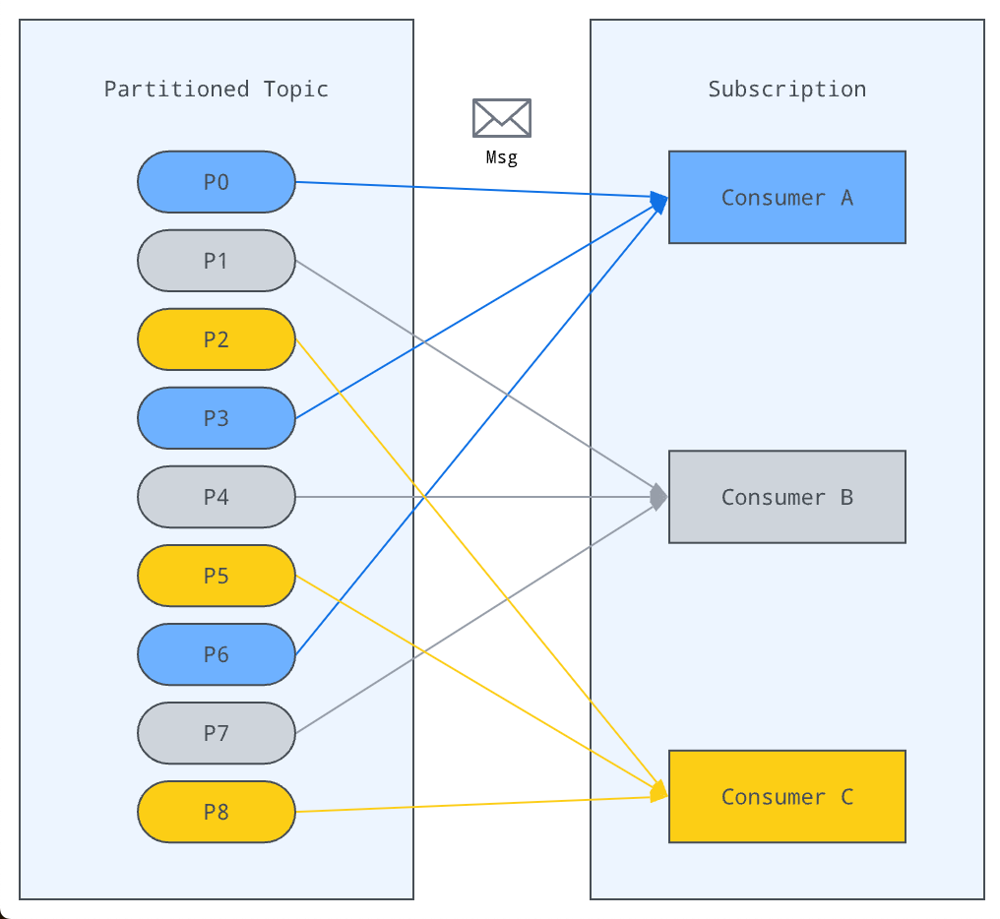
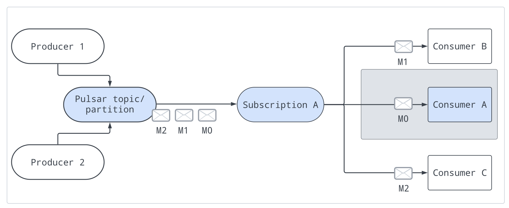
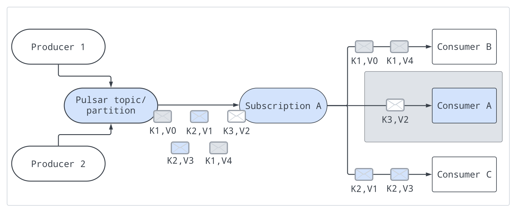

# Go Pulsar

## Setup

### Install Go packages

```bash
go mod tidy && go mod download
```

### Start a standalone Pulsar cluster in Docker

```bash
docker run -it -d \
-e PULSAR_STANDALONE_USE_ZOOKEEPER=1 \
-p 6650:6650 \
-p 8080:8080 \
--mount source=pulsardata,target=/pulsar/data \
--mount source=pulsarconf,target=/pulsar/conf \
apachepulsar/pulsar:3.2.2 \
bin/pulsar standalone
```

## Pulsar

Pulsar is a multi-tenant, high-performance solution for server-to-server messaging.

Key features:

- Very low publish and end-to-end latency. HOW?
- Seamless scalability to over a million topics.
- Multiple subscription types (exclusive, shared, and failover) for topics.
- Guaranteed message delivery with persistent message storage provided by **Apache BookKeeper**.
- A serverless lightweight computing framework **Pulsar Functions** offers the capability for stream-native data processing.
- A serverless connector framework **Pulsar IO**, which is built on Pulsar Functions, makes it easier to move data in and out of Apache Pulsar.
- Tiered Storage offloads data from hot/warm storage to cold/long-term storage (such as S3 and GCS) when the data is aging out.

### Messaging



### Subscriptions

There are four subscription types in Pulsar:

- exclusive
- shared
- failover
- key_shared


- Pub-Sub or Queuing In Pulsar, you can use different subscriptions flexibly.
  - To achieve traditional "fan-out pub-sub messaging" among consumers, specify a unique subscription name for each consumer. It is an exclusive subscription type.
  - To achieve "message queuing" among consumers, share the same subscription name among multiple consumers (shared, failover, key_shared).
  - To achieve both effects simultaneously, combine exclusive subscription types with other subscription types for consumers.

Subscription type - a subscription type is undefined if it has no consumers. The type of the subscription is defined when a consumer connects to it
, and the type can be changed by restarting all consumers with a different configuration.

#### Exclusive

Exclusive is a subscription type that **only allows a single consumer** to attach to the subscription. 

And it's the default subscription type.



#### Failover

Failover is a subscription type that multiple consumers can attach to the same subscription.

A master consumer is picked for a non-partitioned topic and each partitioned topic and receives messages.

When the master consumer disconnected, all (non-acknowledged and subsequent) messages are delivered to the next consumer in line. 

> **_NOTE:_** In some cases, a partition may have an older active consumer processing messages while a newly switched over active consumer starts receiving new messages. **This may lead to message duplication or out-of-order.**

#### Failover | Partitioned topic

The broker sorts consumers by priority and lexicographical order of consumer name.
The broker tries to evenly assign partitions to consumers with the highest priority.

If the number of partitions in a partitioned topic is less than the number of consumers



If the number of partitions in a partitioned topic is greater than the number of consumers



#### Failover | Non-partitioned topic

If there is one non-partitioned topic. The broker picks consumers in the order they subscribe to non-partitioned topics.

If there are multiple non-partitioned topics, a consumer is selected based on **consumer name hash** and **topic name hash**. The client uses the same consumer name to subscribe to all the topics.
Pulsar ensures that each topic is assigned to a specific consumer based on the combination of the consumer's name and the topic's name, thereby evenly distributing the load among consumers

#### Shared

The shared subscription type allows multiple consumers to attach to the same subscription. 

Messages are delivered in a round-robin distribution across consumers, and any given message is delivered to only one consumer. 

When a consumer disconnects, all the messages that were sent to it and not acknowledged will be rescheduled for sending to the remaining consumers.



#### Key_Shared

The Key_Shared subscription type allows multiple consumers to attach to the same subscription.

But messages are delivered in distribution across consumers and messages with the same key or same ordering key are delivered to only one consumer. 

No matter how many times the message is re-delivered, it is delivered to the same consumer.


